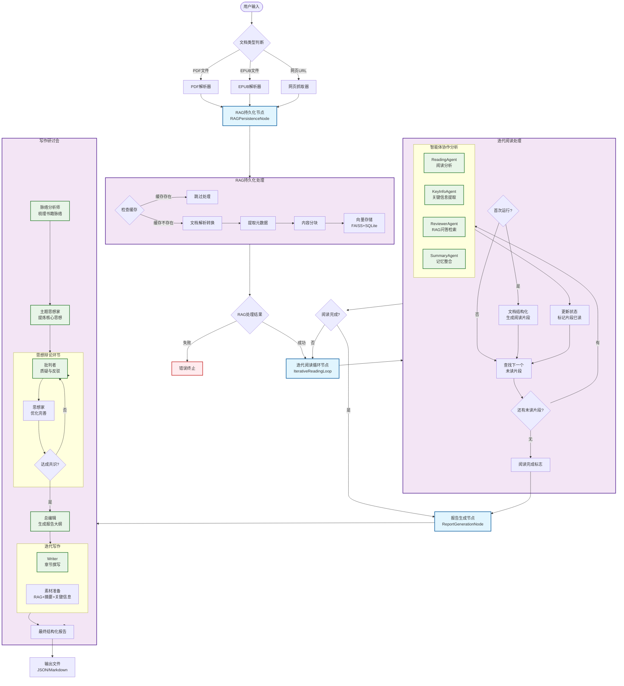

# DeepReader - 智能文档深度阅读与分析系统

## 🎯 项目简介

**DeepReader** 是一个基于 LangGraph 的高级智能文档阅读和分析系统，旨在模拟人类专家的沉浸式、反思式阅读过程。该系统能够在短时间内深度理解、分析和重构任何长篇或复杂的文档（如书籍、财报、研究论文等），并根据用户的特定需求生成高度定制化的知识产物。

### 核心特色

- 🤖 **多智能体协作**：通过 ReadingAgent、ReviewerAgent、SummaryAgent 等多个专业化AI代理的协同工作，实现对文档的多维度、深层次分析。
- 🧠 **主动式迭代阅读**：模仿人类精读过程，包含提出问题、基于问题进行检索（RAG）、生成边栏笔记、整合记忆等步骤，循环往复直至读完整篇文档。
- 🔍 **RAG 增强分析**：内置基于 FAISS 和 SQLite 的本地向量数据库，在阅读过程中随时进行语义检索和深度问答，发现跨章节的隐藏关联。使用 OpenAI text-embedding-3-large 进行文档向量化。
- 💾 **状态持久化与断点续传**：所有处理过程和状态都通过 LangGraph 的 Checkpointer 机制进行持久化，支持从任意中断点无缝恢复任务，无惧长文档处理过程中的意外中断。
- 📊 **结构化与定制化输出**：能够生成章节摘要、主题思想分析、批判性辩论记录、完整分析报告等多种结构化的知识产物。

### 🛠️ 技术栈

**AI & LLM**
- 🧠 Google Gemini (2.0-flash, 2.5-flash, 2.5-pro) - LLM 推理
- 🔤 OpenAI text-embedding-3-large - 文档向量化

**检索系统**
- 📚 FAISS (Facebook AI Similarity Search) - 向量相似度检索
- 💾 SQLite - 文档块元数据存储
- 🔗 LangChain - RAG 框架集成

**工作流编排**
- 🔄 LangGraph - 多智能体工作流
- 💿 AsyncSqliteSaver - 状态持久化

**文档处理**
- 📕 marker-pdf - PDF 转 Markdown
- 📚 ebooklib - EPUB 处理
- 🧹 BeautifulSoup4 - HTML 清理

**用户交互**
- 💬 prompt_toolkit - 增强命令行交互

---

## ⚙️ 工作机制

DeepReader 的核心是一个由 LangGraph 精心编排的、有状态的图（Graph）。这个图定义了一系列节点（工作单元）和边（流转条件），模拟了专家的阅读思考流程。

### 系统工作流程



**系统核心架构说明：**

### 🔄 三大核心节点

**1. RAG持久化节点 (RAGPersistenceNode)**
- **功能**：文档预处理和向量化存储
- **缓存机制**：基于文档路径哈希检查，避免重复处理
- **输出**：Markdown内容、元数据、分块数据、FAISS向量库

**2. 迭代阅读循环节点 (IterativeReadingLoop)**  
- **功能**：模拟人类专家的主动式阅读过程
- **智能体协作**：ReadingAgent、KeyInfoAgent、ReviewerAgent、SummaryAgent 并行工作
- **状态管理**：维护阅读进度、跨片段上下文、累积记忆

**3. 报告生成节点 (ReportGenerationNode)**
- **功能**：多轮辩论式写作研讨会
- **写作流程**：脉络分析 → 主题提炼 → 批判辩论 → 大纲制定 → 迭代写作
- **并行优化**：素材准备（RAG检索、摘要选择、关键信息筛选）同步进行

### 🎯 关键特性

- **状态持久化**：所有处理状态通过 LangGraph Checkpointer 保存，支持断点续传
- **并行处理**：多个 Agent 同时工作，提高处理效率
- **智能缓存**：避免重复处理相同文档
- **条件流转**：基于处理结果动态决定下一步流程

---

## 🚀 快速开始

### 1. 环境要求

- Python 3.12 或更高版本
- macOS、Linux 或 Windows 系统

### 2. 安装

**克隆项目并进入目录**
```bash
git clone https://github.com/kirkluokun/deepreader.git
cd deepreader
```

**创建虚拟环境并安装依赖**

macOS/Linux:
```bash
python3 -m venv .venv
source .venv/bin/activate
pip install -r requirements.txt
```

Windows:
```bash
python -m venv .venv
.venv\Scripts\activate
pip install -r requirements.txt
```

### 3. 配置 API 密钥

复制配置模板并填入你的 API 密钥：

```bash
cp .env.example .env
```

编辑 `.env` 文件，填入以下两个必需的 API 密钥：

```bash
# Google Gemini API（获取：https://aistudio.google.com/app/apikey）
GOOGLE_API_KEY=your-google-api-key-here

# OpenAI API（获取：https://platform.openai.com/api-keys）
OPENAI_API_KEY=your-openai-api-key-here
```

**⚠️ 说明：** DeepReader 是本地文档分析系统，不需要搜索引擎 API（如 Serper、Tavily 等）。

### 4. 运行程序

```bash
python main.py
```

## 📄 支持的文件格式

DeepReader 支持多种文档格式，系统会自动检测并处理：

### 📋 Markdown 文件 (.md)
- **处理方式**：直接读取，无需转换
- **适用场景**：已经是 Markdown 格式的文档
- **示例**：`/path/to/document.md`

### 📕 PDF 文件 (.pdf)
- **处理方式**：使用本地 marker 进行高质量转换
- **转换特性**：
  - 保留文档结构和格式
  - 智能识别表格和公式
  - 禁用图片提取以专注文本内容
- **输出位置**：在同目录下创建 `文件名/文件名.md`
- **示例**：`/path/to/annual_report.pdf` → `/path/to/annual_report/annual_report.md`

### 📚 EPUB 电子书 (.epub)
- **处理方式**：使用 ebooklib 提取文本内容
- **转换特性**：
  - 提取所有章节内容
  - 保留段落结构
  - 自动清理 HTML 标签
- **输出位置**：在同目录下创建 `文件名/文件名.md`
- **示例**：`/path/to/book.epub` → `/path/to/book/book.md`

## 🔄 智能文档处理流程

### 程序启动后的交互流程：

1. **文件路径输入**：输入支持的文件格式路径
   ```
   请输入待处理文件的绝对路径: /Users/username/Documents/report.pdf
   ```

2. **自动格式检测**：系统识别文件类型并选择相应处理器

3. **转换处理**（如需要）：
   - PDF：调用 marker 进行转换
   - EPUB：调用 ebooklib 进行提取
   - Markdown：直接读取

4. **文档清理提示**：
   ```
   ⚠️  请检查生成的 Markdown 文件并进行必要的清理：
      - 删除不相关的内容（如附录、声明等）
      - 检查格式是否正确
      - 确保章节结构清晰
   
   请完成文件清理后按回车键继续...
   ```

5. **继续分析**：确认清理完成后，进入 DeepReader 智能分析流程

## 💡 文档质量优化建议

### 🎯 为什么需要人工清理？

**提升 LLM 处理效率**：
- 🚀 **减少噪音**：移除无关内容可以让 AI 专注于核心信息
- 📊 **提高准确性**：清晰的结构有助于 AI 更好地理解文档层次
- ⚡ **节省 Token**：减少不必要的内容可以降低 API 成本
- 🎯 **增强相关性**：保留与研究问题相关的内容

### 📝 推荐的清理步骤：

**1. 删除冗余部分**
- 版权声明和法律条款
- 重复的目录和索引
- 大量的附录和参考文献
- 广告和推广内容

**2. 优化格式结构**
- 确保标题层次清晰（使用 #、##、### 等）
- 保留重要的表格和数据
- 修正转换错误的格式

**3. 保留核心内容**
- 主要章节和论述
- 关键数据和图表说明
- 重要的结论和观点
- 与研究问题相关的案例

**4. 验证文档质量**
- 检查是否有乱码或格式错误
- 确认章节完整性
- 验证重要信息是否保留

### 📋 用户输入信息：

完成文档处理后，系统会提示输入：

1. **核心探索问题**：您希望通过阅读解决的核心问题
   - 示例：`"这家公司去年的核心增长动力是什么？"`
   - 示例：`"这本书的主要观点和实践建议是什么？"`

2. **期望的研究角色**：指定 AI Agent 的分析视角
   - 示例：`"资深财务分析师"`
   - 示例：`"技术架构师"`
   - 示例：`"产品经理"`

## 🎬 使用示例

```bash
# 启动程序
python main.py

# 按提示输入信息
============================================================
📚 DeepReader - 深度阅读助手
============================================================

📄 待处理文件的绝对路径
   > /Users/username/Documents/深度思考.epub

✅ 文件已选择: 深度思考.epub

🎯 您的核心探索问题（这将指导整个分析过程）
   > 如何培养深度思考的能力？

✅ 核心问题: 如何培养深度思考的能力？

👤 研究角色
   > 教育研究者

✅ 研究角色: 教育研究者

============================================================

# 系统自动处理并生成报告
--- 任务信息 ---
文档: 深度思考.epub
任务ID: 7d43b281...

--- 进入增强型 RAG 持久化节点 ---
--- 迭代式阅读节点开始 ---
--- 报告生成节点启动：写作研讨会开始 ---

# 分析完成
✅ 完整状态已保存: output/20251106_163542_深度思考/final_state.json
✅ 已生成报告: chapter_summary.md
✅ 已生成报告: draft_report.md
✅ 已生成报告: thematic_analysis.md
✅ 已生成报告: debate_questions.md
```

---

## ⚠️ 常见问题

### macOS OpenMP 冲突错误

如果在 macOS 上运行时遇到 `OMP: Error #15` 错误，这是 OpenMP 库冲突导致的。解决方法已内置在 `main.py` 中，无需额外配置。

### 依赖版本冲突

如果遇到依赖版本警告，通常不影响运行。如果出现实际错误，可以重新创建虚拟环境：

```bash
rm -rf .venv
python3 -m venv .venv
source .venv/bin/activate  # Windows: .venv\Scripts\activate
pip install -r requirements.txt
```

---

## 📁 项目结构

```
deepreader/
├── main.py                       # 主程序入口
├── .env.example                  # 环境变量配置模板
├── requirements.txt              # 依赖清单
├── backend/
│   ├── config.py                 # 系统配置（模型、模式等）
│   ├── read_graph.py             # LangGraph 工作流定义
│   ├── read_state.py             # 状态对象定义
│   ├── prompts.py                # 所有 Agent 的 Prompt 模板
│   ├── components/               # 核心组件
│   │   ├── llm.py                # LLM 调用封装
│   │   ├── vector_store.py       # FAISS 向量数据库
│   │   └── google_llm.py         # Google SDK 封装
│   ├── graph/                    # LangGraph 节点
│   │   ├── nodes/                # 三大核心节点
│   │   │   ├── RAGPersistenceNode.py
│   │   │   ├── IterativeReadingLoop.py
│   │   │   └── ReportGenerationNode.py
│   │   └── actions/              # 业务逻辑
│   ├── scraper/                  # 文档解析器
│   │   ├── pdf_converter.py      # PDF → Markdown
│   │   ├── epub_converter.py     # EPUB → Markdown
│   │   └── clean_rule.py         # 文本清洗
│   ├── cache/                    # 检查点和会话缓存
│   └── memory/                   # FAISS 向量存储
└── output/                       # 分析结果输出
    └── {timestamp}_{document}/
        ├── draft_report.md       # ⭐ 最终报告
        ├── chapter_summary.md    # 章节摘要
        ├── thematic_analysis.md  # 核心思想
        ├── debate_questions.md   # 深度问答
        └── final_state.json      # 完整状态
```

## 📊 输出结果

分析完成后，所有结果将保存在 `output/` 目录下，以时间戳和文档名命名的子目录中：

```
output/20251106_163542_深度思考/
├── final_state.json         # 完整分析状态（包含所有中间结果）
├── chapter_summary.md       # 各章节的详细摘要
├── draft_report.md          # 最终结构化分析报告
├── thematic_analysis.md     # 主题思想分析（核心观点、结论、证据）
└── debate_questions.md      # 阅读过程中的深度问答记录
```

### 输出文件说明

- **final_state.json**: 包含整个处理过程的完整状态，可用于调试或进一步处理
- **chapter_summary.md**: ReadingAgent 生成的各章节摘要，保留文档结构
- **draft_report.md**: 写作研讨会产出的最终报告，直接回答用户的核心问题
- **thematic_analysis.md**: 经过多轮辩论提炼的核心思想（key_idea, key_conclusion, key_evidence）
- **debate_questions.md**: 阅读阶段 ReviewerAgent 基于 RAG 检索回答的问题列表

## 🤝 贡献指南

我们欢迎各种形式的贡献，包括 Bug 报告、功能建议和代码贡献。请通过提交 Pull Request 或创建 Issue 的方式参与项目。

## 📄 许可证

本项目采用 [MIT License](LICENSE) 开源协议。
