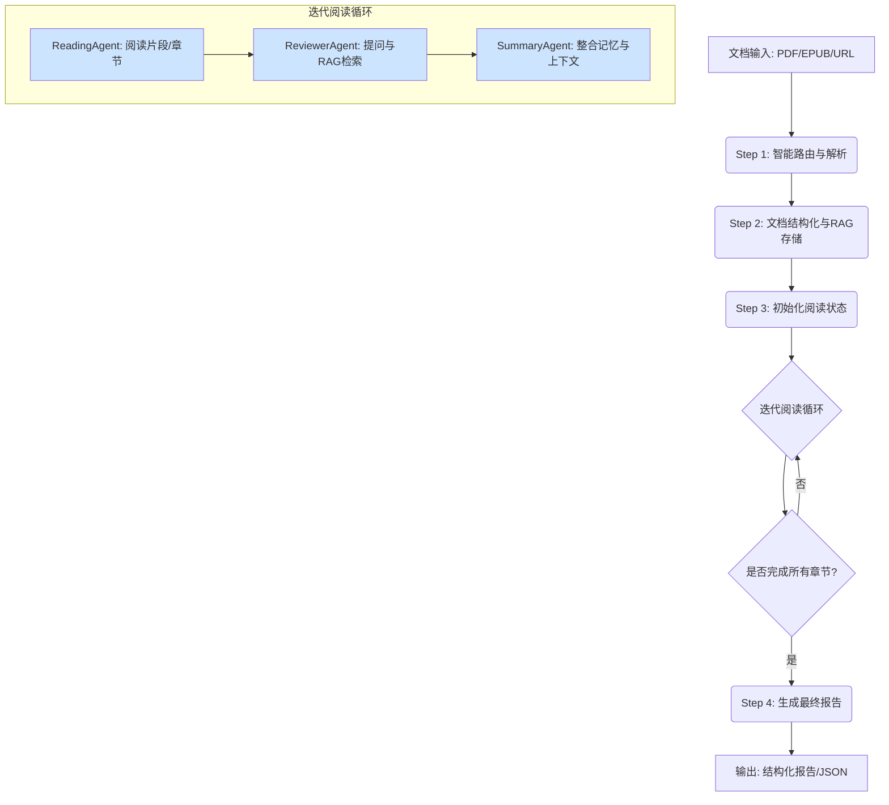

# DeepReader - 智能文档深度阅读与分析系统

## 🎯 项目简介

**DeepReader** 是一个基于 LangGraph 的高级智能文档阅读和分析系统，旨在模拟人类专家的沉浸式、反思式阅读过程。该系统能够在短时间内深度理解、分析和重构任何长篇或复杂的文档（如书籍、财报、研究论文等），并根据用户的特定需求生成高度定制化的知识产物。

### 核心特色

- 🤖 **多智能体协作**：通过 ReadingAgent、ReviewerAgent、SummaryAgent 等多个专业化AI代理的协同工作，实现对文档的多维度、深层次分析。
- 🧠 **主动式迭代阅读**：模仿人类精读过程，包含提出问题、基于问题进行检索（RAG）、生成边栏笔记、整合记忆等步骤，循环往复直至读完整篇文档。
- 🔍 **RAG 增强分析**：内置基于 FAISS 和 SQLite 的本地知识库，在阅读过程中随时进行全文检索和深度问答，发现跨章节的隐藏关联。
- 💾 **状态持久化与断点续传**：所有处理过程和状态都通过 LangGraph 的 Checkpointer 机制进行持久化，支持从任意中断点无缝恢复任务，无惧长文档处理过程中的意外中断。
- 📊 **结构化与定制化输出**：能够生成章节摘要、主题思想分析、批判性辩论记录、完整分析报告等多种结构化的知识产物。

---

## ⚙️ 工作机制

DeepReader 的核心是一个由 LangGraph 精心编排的、有状态的图（Graph）。这个图定义了一系列节点（工作单元）和边（流转条件），模拟了专家的阅读思考流程。

### 系统工作流程



1.  **智能路由与解析 (Step 1)**：系统自动识别输入源（本地文件、URL），并调用相应的解析器（如 Marker 处理 PDF）将其高质量地转换为 Markdown 格式。
2.  **文档结构化与RAG存储 (Step 2)**：系统解析 Markdown 内容，提取目录结构。同时，将文档分块（Chunking）并使用 FAISS 创建向量索引，为后续的 RAG 检索做好准备。
3.  **迭代阅读循环 (Step 3)**：这是系统的核心。
    -   **ReadingAgent**：负责阅读当前章节或片段，生成摘要、提取核心观点，并提出需要进一步探究的深度问题。
    -   **ReviewerAgent**：接收 ReadingAgent 提出的问题，利用 RAG 在整个文档的知识库中进行检索，寻找答案或相关信息，以补充上下文或发现跨章节的联系。
    -   **SummaryAgent**：整合前两个 Agent 的输出，更新全局的"阅读记忆"，为下一轮的阅读提供更丰富的背景信息。
4.  **生成最终报告 (Step 4)**：在所有章节都经过迭代阅读后，系统会启动最终的报告生成流程，对整个阅读过程的产出进行汇总、整理和润色，最终形成多种格式的分析报告。

---

## 🚀 快速开始

请遵循以下步骤来安装和运行 DeepReader。

### 1. 环境与版本管理 (强烈推荐)

为了保证项目在不同环境下的一致性，我们强烈建议使用 `pyenv` 来管理 Python 版本，并结合 `poetry` 管理项目依赖。

**a. 安装 pyenv** (如果尚未安装)
```bash
# 对于 macOS (使用 Homebrew)
brew install pyenv
```
安装后，请根据 `pyenv` 的提示完成 shell 的初始化配置。

**b. 安装指定的 Python 版本**
本项目在 `pyproject.toml` 中指定的 Python 版本为 `3.12.3`。
```bash
# 安装 python 3.12.3
pyenv install 3.12.3

# 进入项目目录
# git clone <your-repo-url>
# cd FinAIcrew/dynamic-gptr/gpt_researcher/deepreader

# 为当前目录设置 python 版本
pyenv local 3.12.3
```
设置成功后，在此目录中执行 `python --version` 应该会显示 `3.12.3`。`poetry` 会自动检测并使用这个由 `pyenv` 设置的版本。

### 2. 安装依赖

您可以选择使用 `poetry` 或 `pip` 来安装项目依赖。

#### 方式一：使用 Poetry (推荐)

**a. 克隆项目并进入目录**
```bash
git clone https://github.com/kirkluokun/deepreader.git
cd deepreader
```

**b. 使用 Poetry 安装依赖**
```bash
# 这将创建一个虚拟环境并安装所有在 pyproject.toml 中定义的依赖
poetry install
```

**c. 激活 Poetry 的虚拟环境**
```bash
poetry shell
```
之后的所有命令都将在这个虚拟环境中执行。

#### 方式二：使用 pip 和 requirements.txt

如果您不使用 Poetry，也可以使用传统的 `requirements.txt` 文件。

**a. 克隆项目并进入目录**
```bash
git clone https://github.com/kirkluokun/deepreader.git
cd deepreader
```

**b. 创建并激活虚拟环境**
```bash
# 创建虚拟环境
python3 -m venv .venv

# 激活虚拟环境 (macOS/Linux)
source .venv/bin/activate
```

**c. 安装依赖**
```bash
pip install -r requirements.txt
```

### 3. 配置环境变量

DeepReader 需要访问 LLM 服务。请在终端中设置您的 API 密钥。

```bash
# 以 OpenAI 为例
export OPENAI_API_KEY="your-openai-api-key"

或者在.env中设置api_key

# 如果您使用其他模型，也请设置相应的环境变量
# export GOOGLE_API_KEY="..."
```

### 4. 运行系统

确保您已进入 `deepreader` 目录并已激活虚拟环境。

```bash
python main.py
```
程序启动后，会提示您输入以下信息：
1.  **待处理文件的绝对路径**：例如 `../annual_report.pdf`
2.  **核心探索问题**：您希望通过阅读解决的核心问题，例如"这家公司去年的核心增长动力是什么？"
3.  **期望的研究角色**：指定 AI Agent 的分析视角，例如"资深财务分析师"。

---

## 📁 项目结构

```
deepreader/
├── main.py                 # 主程序入口
├── README.md               # 本文档
├── pyproject.toml          # Poetry 依赖与项目配置
├── requirements.txt        # pip 依赖文件
├── backend/
│   ├── read_graph.py       # LangGraph 工作流定义
│   ├── read_state.py       # 核心状态对象 (State)
│   ├── config.py           # 系统配置 (模型、解析策略等)
│   ├── prompts.py          # 所有 Prompt 模板
│   ├── components/         # 核心组件 (LLM调用, 向量数据库等)
│   ├── graph/              # LangGraph 的节点与业务逻辑
│   ├── scraper/            # 文档解析器 (PDF, EPUB, Web)
│   └── cache/              # 缓存目录 (检查点, 会话信息等)
└── output/                 # 分析结果输出目录
```

## 📊 输出结果

分析完成后，所有结果将保存在 `output/` 目录下，以时间戳和文档名命名的子目录中。
- `final_state.json`: 包含所有中间过程和最终结果的完整 JSON 数据。
- `chapter_summary.md`: 各章节的详细摘要。
- `draft_report.md`: 格式化后的最终分析报告。
- `thematic_analysis.md`: 主题思想分析。
- `debate_questions.md`: AI 代理在阅读过程中提出的深度问题及 RAG 检索到的答案。

## 🤝 贡献指南

我们欢迎各种形式的贡献，包括 Bug 报告、功能建议和代码贡献。请通过提交 Pull Request 或创建 Issue 的方式参与项目。

## 📄 许可证

本项目采用 [MIT License](LICENSE) 开源协议。
